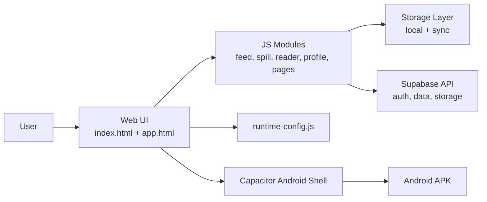

# Tea Spill

<p align="center">
	
</p>

<p align="center">
	Anonymous social tea platform for campus and company communities.<br/>
	Built as a fast static web app with Android delivery through Capacitor.
</p>

<p align="center">
	<a href="https://github.com/Diwakar-odds/Tea_Spill/stargazers"></a>
	
	
	
</p>

## Table of Contents

- [Why Tea Spill](#why-tea-spill)
- [Highlights](#highlights)
- [Architecture](#architecture)
- [Quick Start](#quick-start)
- [Runtime Configuration](#runtime-configuration)
- [Mobile Build Flow](#mobile-build-flow)
- [NPM Command Reference](#npm-command-reference)
- [Project Structure](#project-structure)
- [Seeded Demo Data](#seeded-demo-data)
- [Deployment on Netlify](#deployment-on-netlify)
- [Security Notes](#security-notes)
- [Roadmap](#roadmap)
- [Contributing](#contributing)
- [FAQ](#faq)
- [License](#license)

## Why Tea Spill

Tea Spill is designed as a lightweight anonymous social platform where users can post short "spills", react, comment, and discover trend-driven communities.

It currently supports:

- Campus circles
- Company employee circles
- Topic-driven pages
- Chat-enabled groups
- Broadcast-style channels

## Highlights

- Anonymous posting experience with profile-safe aliases
- Category-first feed with reactions and comments
- Community layer: pages, groups, and channels
- Moderation/report flow for safer conversations
- Android packaging through Capacitor for distribution
- Hosted-first mobile sync flow with local fallback commands

## Architecture



## Quick Start

### 1) Run in Browser

```bash
npm install
npm run config:runtime
```

Serve the project root with any static server, then open:

- `index.html` for login/onboarding flow
- `app.html` for main authenticated shell

### 2) Build Android (Hosted Mode)

```bash
npm run mobile:sync
npm run mobile:open
```

### 3) Build Android APK (Local Bundle Mode)

```bash
npm run mobile:apk:release:local
```

This local mode is usually the most reliable for launch-safe installs.

## Runtime Configuration

Runtime values are read from `runtime-config.js`.

Required values:

- `SUPABASE_URL`
- `SUPABASE_KEY` (anon/public key)
- `GOOGLE_CLIENT_ID`

Never place `service_role` or any server-secret keys in frontend runtime files.

## Mobile Build Flow

<details>
	<summary><strong>Hosted-first flow (default)</strong></summary>

1. Generate runtime config
2. Prepare mobile web artifacts
3. Ensure Android icons/resources
4. Sync/copy into Capacitor Android project

</details>

<details>
	<summary><strong>Local bundle flow (fallback)</strong></summary>

Use `:local` commands to package and run from local web assets when hosted mode is unavailable or when testing isolated app behavior.

</details>

## NPM Command Reference

| Command | Purpose |
|---|---|
| `npm run config:runtime` | Generate `runtime-config.js` from environment |
| `npm run mobile:prepare` | Prepare mobile web artifacts |
| `npm run mobile:icons:ensure` | Repair/ensure Android launcher icon resources |
| `npm run mobile:copy` | Copy hosted build into Android project |
| `npm run mobile:copy:local` | Copy local build into Android project |
| `npm run mobile:sync` | Sync hosted build into Android project |
| `npm run mobile:sync:local` | Sync local build into Android project |
| `npm run mobile:open` | Open Android project (hosted sync first) |
| `npm run mobile:open:local` | Open Android project (local sync first) |
| `npm run mobile:doctor` | Android SDK/environment checks |
| `npm run mobile:apk:debug` | Build debug APK using hosted mode |
| `npm run mobile:apk:release` | Build release APK using hosted mode |
| `npm run mobile:apk:debug:local` | Build debug APK using local bundle |
| `npm run mobile:apk:release:local` | Build release APK using local bundle |

## Project Structure

```text
.
|- index.html                  # Entry/login screen
|- app.html                    # Main app shell
|- runtime-config.js           # Runtime frontend config
|- css/                        # Styles (global, components, pages)
|- js/                         # App modules
|  |- app.js
|  |- feed.js
|  |- spill.js
|  |- reader.js
|  |- profile.js
|  |- pages.js
|  |- storage.js
|  |- api.js
|  |- data.js
|- data/                       # Static datasets
|- scripts/                    # Build and helper scripts
|- android/                    # Capacitor Android project
|- netlify.toml                # Netlify build/publish settings
```

## Seeded Demo Data

The app currently includes seeded fake data to improve first-time experience:

- Anonymous spills in every category
- 10 pages, 10 groups, and 10 channels
- Approx. 20 seeded items for each community container
- Gen Z trend-inspired topic themes

All seeded data is intentionally fictional and can be removed/reduced later as real user content grows.

## Deployment on Netlify

Configured via `netlify.toml`:

- Build command: `bash scripts/netlify-build.sh`
- Publish directory: `.`

Required Netlify environment variables:

- `SUPABASE_URL`
- `SUPABASE_ANON_KEY`
- `GOOGLE_CLIENT_ID`

Build script generates runtime config during deploy.

## Security Notes

- Keep `.env` local and never commit secrets.
- Runtime defaults in repo are intentionally blank for sensitive keys.
- Client-side config must contain only public-safe values.
- Use moderation/report flow for harmful or personal-information content.

## Roadmap

- [x] Core feed, reaction, and comments
- [x] Pages, groups, and channels
- [x] Android packaging workflow
- [x] Seeded anonymous launch data
- [ ] Stronger analytics and trend dashboards
- [ ] Rich media and short-video posting
- [ ] Automated moderation scoring
- [ ] iOS delivery path

## Contributing

Contributions are welcome.

1. Fork the repo
2. Create a feature branch
3. Commit focused changes
4. Open a pull request with clear context and screenshots/logs if relevant

## FAQ

<details>
	<summary><strong>Is this production-ready?</strong></summary>

Core flows are in place and deployable, but you should still harden monitoring, moderation, and release operations before large-scale public rollout.

</details>

<details>
	<summary><strong>Why does fresh seeded data not appear on my device?</strong></summary>

Local storage may already have older cached state. Clear app/local storage and reload to rehydrate from latest seeded constants.

</details>

<details>
	<summary><strong>Which APK build mode should I use?</strong></summary>

For stability, prefer `npm run mobile:apk:release:local` when preparing installable builds for distribution testing.

</details>

## License

ISC
